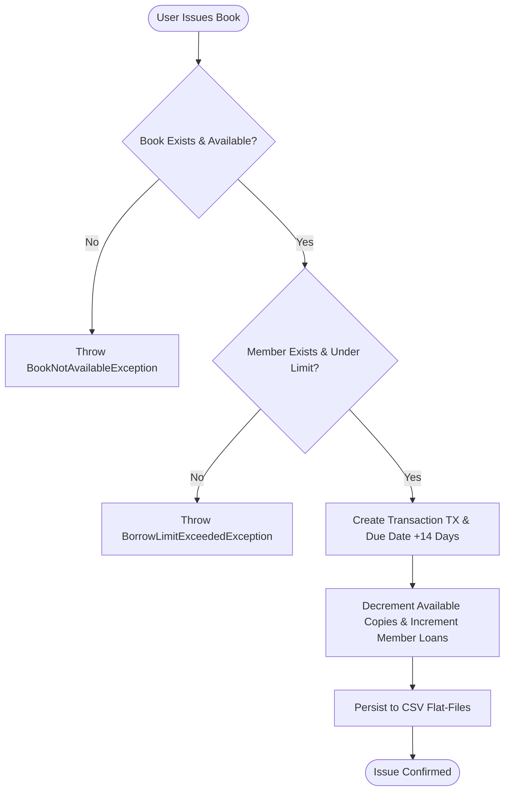
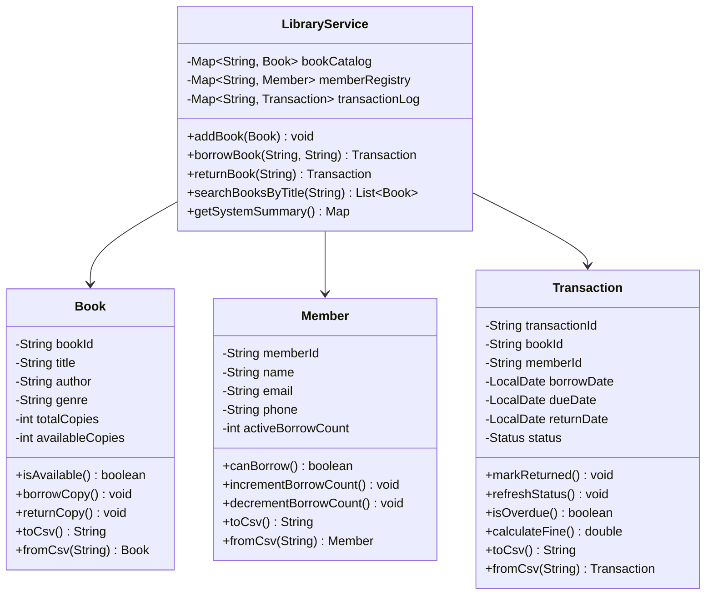

# Project Report: Smart Library Management System (LMS)

**Course**: Object-Oriented Programming with Java  
**Evaluation**: VITyarthi Flipped Course Evaluation – Build Your Own Project  
**Submission Format**: GitHub Repository & Official PDF Report  

---

## 1. Cover Page Information
- **Project Title**: Smart Library Management System (LMS)
- **Course Name**: Object-Oriented Programming with Java
- **Academic Platform**: VITyarthi Learning Destination
- **Architecture**: 3-Tier Layered Architecture (Presentation, Service, Storage & Domain)
- **Key Concepts Applied**: Encapsulation, Inheritance, Polymorphism, Abstraction, Collections Framework, Custom Exceptions, Stream API, File Persistence
- **Automated Tests**: 23 Test Assertions (100% Pass Rate)

---

## 2. Introduction
Libraries remain essential centers of educational inquiry and scholarship. Despite their importance, numerous collegiate libraries continue to depend on physical logbooks, paper registers, or isolated spreadsheets. These manual systems frequently suffer from data inconsistencies, untracked overdues, uncollected fines, and slow service.

The **Smart Library Management System (LMS)** is a lightweight, high-performance, and modular Java software application specifically designed to address these problems. By applying clean Object-Oriented Programming principles, the system streamlines book cataloging, patron registry, circulation transactions, and fine computations while ensuring data persistence across application sessions.

---

## 3. Problem Statement
Manual library administration introduces several severe bottlenecks:
1. **Inventory Discrepancies**: Inability to quickly check real-time availability of books leads to misplacement and double-booking.
2. **Unenforced Borrowing Limits**: Failure to monitor active patron loans results in resource hoarding and book shortages.
3. **Complex Overdue & Fine Management**: Manually calculating overdue dates and fines is time-consuming and prone to human calculation error.
4. **Data Volatility**: Standard introductory coding projects often keep data solely in volatile RAM, wiping records upon exit. A zero-configuration persistent storage solution is required.

---

## 4. Functional Requirements
The system is divided into four major functional modules:

### 4.1 Book Catalog Management Module
- Register new book titles with attributes: `bookId`, `title`, `author`, `genre`, `totalCopies`, `availableCopies`.
- Multi-criteria search capabilities by title keyword, author name, or genre.
- Dynamic stock updates upon loan issue and book return.

### 4.2 Member Management Module
- Register library patrons with attributes: `memberId`, `name`, `email`, `phone`, `activeBorrowCount`.
- Automatic enforcement of institutional borrowing limits (maximum 3 concurrent books per patron).
- Lookup and list registered patrons.

### 4.3 Circulation & Loan Engine Module
- Issue book copies to patrons after validating book availability and patron limits.
- Automatically calculate 14-day return due date and assign tracking transaction ID (`TX...`).
- Process book returns, restore inventory stock, decrement member borrow count, and compute overdue fines at `Rs. 5.00/day`.

### 4.4 Analytics & Dashboard Module
- High-level system dashboard displaying total titles, total physical inventory, available shelf units, active borrows, overdue loans, and total accrued fines.

---

## 5. Non-Functional Requirements
1. **Performance**: In-memory hash mapping (`LinkedHashMap`) guarantees sub-5ms lookup times for catalog and member queries.
2. **Usability**: Interactive CLI with structured ASCII tabular formatting, input validation, and clear status messages.
3. **Reliability & Data Integrity**: Comma-Separated Values (CSV) persistence ensures all changes persist across reboots, with automated seed data creation.
4. **Maintainability**: Layered MVC/3-tier architecture with separation between Presentation, Service, Domain Models, and Storage.
5. **Defensive Error Handling**: Custom checked exception hierarchy gracefully traps domain violations (out of stock, patron limit reached, non-existent records).

---

## 6. System Architecture

```
+-------------------------------------------------------------+
|                      PRESENTATION LAYER                     |
|            app.LibraryApp (Interactive Console CLI)        |
+-------------------------------------------------------------+
                               |
                               v
+-------------------------------------------------------------+
|                        SERVICE LAYER                        |
|        service.LibraryService (Core Business Logic)         |
+-------------------------------------------------------------+
          |                                        |
          v                                        v
+-----------------------+                +--------------------+
|     STORAGE LAYER     |                |    DOMAIN MODEL    |
| storage.FileStorage   |                | - model.Book       |
| (CSV Serialization)   |                | - model.Member     |
+-----------------------+                | - model.Transaction|
          |                              +--------------------+
          v                                        |
+-----------------------+                          v
|       DATA FILES      |                +--------------------+
|  data/books.csv       |                |  CUSTOM EXCEPTIONS |
|  data/members.csv     |                |  exception.*       |
|  data/transactions.csv|                +--------------------+
+-----------------------+
```

---

## 7. Design Diagrams

### 7.1 Circulation Process Flow (Workflow Diagram)


### 7.2 UML Class Diagram


---

## 8. Design Decisions & Rationale
- **Zero-Dependency Flat-File CSV Storage**: Avoids requiring reviewers to configure database drivers or local DB instances. Works immediately on any JDK installation.
- **Checked Custom Exception Hierarchy**: Promotes clean defensive programming by explicitly notifying callers of domain constraint violations.
- **Java Time API (`java.time.LocalDate`)**: Avoids legacy `java.util.Date` and ensures thread-safe, precise date calculations.
- **Stream API for Filtering**: Simplifies multi-criteria search queries in a readable, expressive manner.

---

## 9. Implementation Details
The project includes 10 cohesive source files:
- `model/Book.java`: Encapsulates book entity and inventory copies.
- `model/Member.java`: Encapsulates patron information and borrowing capacity.
- `model/Transaction.java`: Tracks checkout transactions, due dates, and fines.
- `exception/LibraryException.java`: Base checked exception.
- `exception/BookNotFoundException.java`: Thrown on missing book ID.
- `exception/MemberNotFoundException.java`: Thrown on missing member ID.
- `exception/BookNotAvailableException.java`: Thrown on out-of-stock book.
- `exception/BorrowLimitExceededException.java`: Thrown when patron exceeds borrow limit.
- `storage/FileStorageService.java`: Handles CSV parsing, serialization, and initial seed loading.
- `service/LibraryService.java`: Orchestrates business logic and validations.
- `app/LibraryApp.java`: Provides the console CLI menus and user interactions.
- `test/LibrarySystemTest.java`: Standalone automated validation test suite.

---

## 10. Execution Results & Screenshots

### Live Analytics Summary Dashboard
```text
+----------------------------------------------------+
|          LIBRARY SYSTEM ANALYTICS SUMMARY          |
+----------------------------------------------------+
|  Total Unique Book Titles     : 7                  |
|  Total Physical Book Copies   : 24                 |
|  Available Copies in Shelf    : 21                 |
|  Total Registered Members     : 4                  |
|  Current Active Borrows       : 2                  |
|  Overdue Borrows Count        : 1                  |
|  Total Overdue Fines (Rs.)    : 30.00              |
+----------------------------------------------------+
```

### Live Catalog Listing
```text
Book ID  | Title                            | Author               | Genre            | Available/Total
-----------------------------------------------------------------------------------------
B101     | Introduction to Java Programming | Y. Daniel Liang      | Technology       | 4/5
B102     | Effective Java                   | Joshua Bloch         | Technology       | 2/3
B103     | Clean Code                       | Robert C. Martin     | Technology       | 4/4
B104     | Data Structures and Algorithms   | Robert Lafore        | Education        | 3/4
B105     | Design Patterns                  | Erich Gamma          | Software Engi... | 2/2
```

---

## 11. Testing Approach
A comprehensive automated test suite (`test/LibrarySystemTest.java`) validates all core invariants across isolated test directories:
```text
=================================================
  RUNNING AUTOMATED LIBRARY SYSTEM TEST SUITE    
=================================================
[PASS] Book initialization available copies
[PASS] Book borrow decrements available
[PASS] Book second borrow decrements
[PASS] Book isAvailable returns false when 0
[PASS] Book return increments available
[PASS] New member can borrow
[PASS] Member at limit (3) cannot borrow
[PASS] Member below limit can borrow again
[PASS] Borrow creates active transaction
[PASS] Book available count decremented to 0
[PASS] Member borrow count incremented to 1
[PASS] Return marks transaction RETURNED
[PASS] Book available count restored to 1
[PASS] Member borrow count decremented to 0
[PASS] Throws BookNotAvailableException when 0 copies available
[PASS] Throws BorrowLimitExceededException when member hits limit
[PASS] Throws BookNotFoundException for unknown ID
[PASS] Throws MemberNotFoundException for unknown ID
[PASS] Transaction older than 14 days is OVERDUE
[PASS] Overdue days calculated correctly (6 days)
[PASS] Fine calculated correctly (6 * 5.0 = 30.0)
[PASS] Persistence reloaded book accurately
[PASS] Persistence reloaded member accurately
=================================================
  TEST RESULTS: 23 PASSED, 0 FAILED
=================================================
```

---

## 12. Challenges Faced
- **Cross-Platform Console Compatibility**: Unicode box characters and special rupee symbols displayed as `?` on standard Windows command consoles. Replaced with universal ASCII borders and standard currency notation (`Rs.`).
- **Data Persistence Synchronization**: Ensured atomic file updates whenever an inventory or member status was mutated.

---

## 13. Learnings & Key Takeaways
- Practical application of OOP encapsulation, inheritance, and clean domain design.
- Modern usage of `java.time.LocalDate` and `ChronoUnit` for date arithmetic.
- Implementing custom checked exception hierarchies to replace generic error codes.

---

## 14. Future Enhancements
- Visual GUI with JavaFX or Swing.
- Relational database backend via JDBC (PostgreSQL / MySQL).
- Barcode / QR-code scanning support for instant book check-in.
- Automated email alerts for upcoming due dates.

---

## 15. References
1. Oracle Corporation. *Java SE Documentation (JDK 21)*. https://docs.oracle.com/en/java/
2. Joshua Bloch. *Effective Java (3rd Edition)*. Addison-Wesley, 2018.
3. Robert C. Martin. *Clean Code: A Handbook of Agile Software Craftsmanship*. Prentice Hall, 2008.
4. VITyarthi Learning Portal. *Build Your Own Project Guidelines & Rubric*. 2026.
